# Architecture — Bulwark

This document provides the complete architectural reference for the Bulwark, including system context, component relationships, deployment topologies, and request-processing sequence diagrams. All diagrams use [Mermaid](https://mermaid.js.org) syntax.

---

## 1. System Context (C4 Level 1)

The Bulwark sits between developer tools and public package registries, acting as a policy enforcement gateway. It has no UI and no persistent database — all state is held in-process (config + cache).

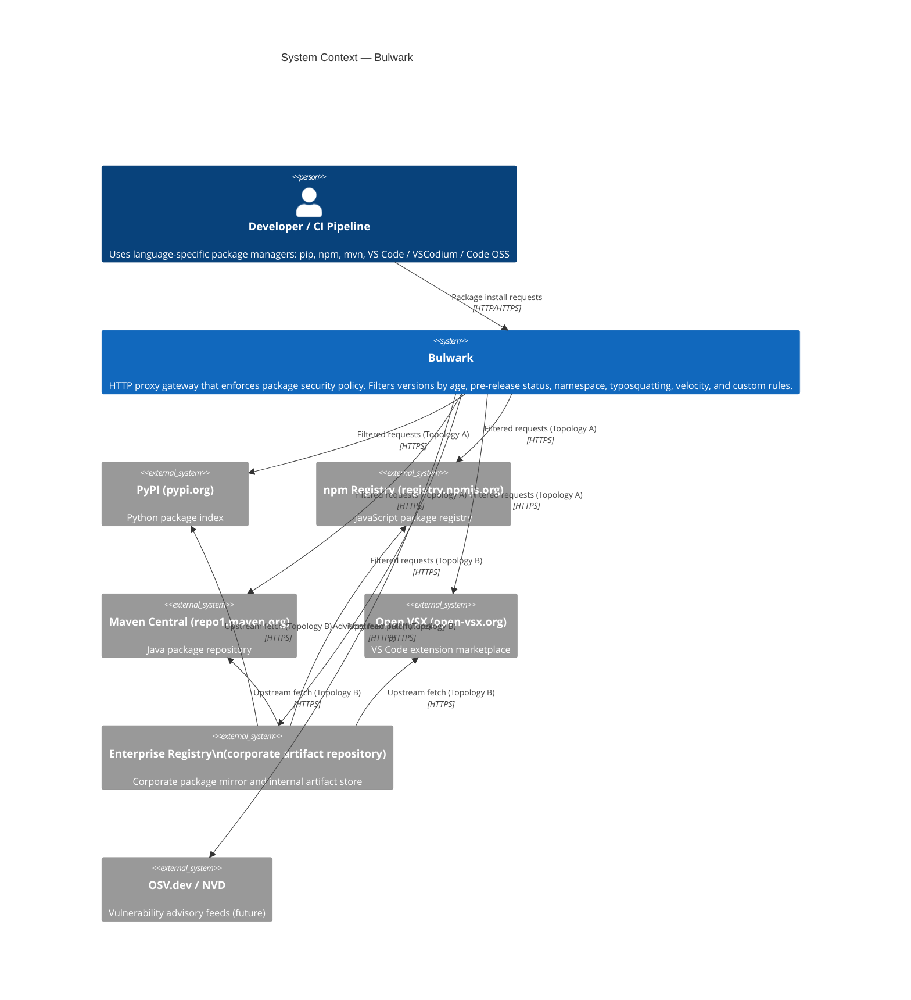

---

## 2. Container Diagram (C4 Level 2)

Each ecosystem is a self-contained Go binary. All binaries share the `common/` module for config types, rule engine, and cache.

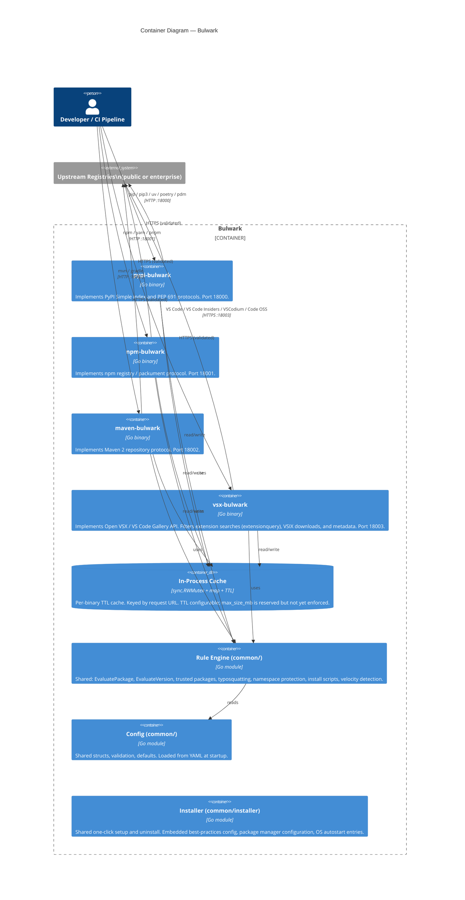

---

## 3. Component Diagram — Single Proxy Binary (C4 Level 3)

The internal structure of each proxy binary follows the same pattern. This diagram uses the PyPI proxy as the reference implementation.

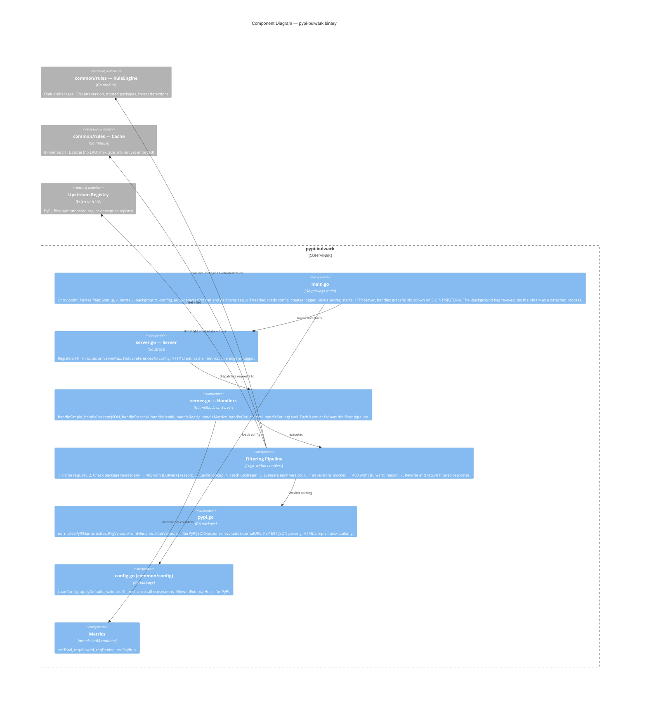

---

## 4. Deployment Topology A — Direct Proxy

Developer tools are pointed directly at the Bulwark. No enterprise registry is involved.

```mermaid
flowchart TD
    subgraph Developer Workstation / CI
        pip["pip / uv / poetry\n~/.pip/pip.conf\nindex-url = http://bulwark:18000/simple/"]
        npm_cli["npm / yarn / pnpm\n.npmrc\nregistry=http://bulwark:18001/"]
        mvn["mvn / gradle\nsettings.xml mirror\nurl: http://bulwark:18002/"]
        vscode["VS Code / VS Code Insiders\nVSCodium / Code OSS\nproduct.json\nserviceUrl: https://bulwark:18003/vscode/gallery"]
    end

    subgraph Kubernetes / Docker — Bulwark Proxy
        direction TB
        PyPI["pypi-bulwark :18000\nTopology A config\nupstream: https://pypi.org"]
        NPM["npm-bulwark :18001\nTopology A config\nupstream: https://registry.npmjs.org"]
        MVN["maven-bulwark :18002\nTopology A config\nupstream: https://repo1.maven.org"]
        VSX["vsx-bulwark :18003\nTopology A config\nupstream: https://open-vsx.org"]
    end

    subgraph Public Internet
        PyPIReg["pypi.org\nfiles.pythonhosted.org"]
        NpmReg["registry.npmjs.org"]
        MavenCentral["repo1.maven.org"]
        OpenVSX["open-vsx.org"]
    end

    pip -->|HTTP :18000| PyPI
    npm_cli -->|HTTP :18001| NPM
    mvn -->|HTTP :18002| MVN
    vscode -->|HTTP :18003| VSX

    PyPI -->|HTTPS filtered| PyPIReg
    NPM -->|HTTPS filtered| NpmReg
    MVN -->|HTTPS filtered| MavenCentral
    VSX -->|HTTPS filtered| OpenVSX

    style PyPI fill:#2563eb,color:#fff
    style NPM fill:#2563eb,color:#fff
    style MVN fill:#2563eb,color:#fff
    style VSX fill:#2563eb,color:#fff
```

---

## 5. Deployment Topology B — Enterprise Registry Middleware

Developer tools are pointed at the existing enterprise registry. The enterprise registry's remote/proxy repositories are reconfigured to fetch through the Bulwark. No developer client reconfiguration is needed.

```mermaid
flowchart TD
    subgraph Developer Workstation / CI
        pip2["pip / uv / poetry\nindex-url = https://registry.corp.example/pypi/simple/\n(unchanged from before)"]
        npm2["npm / yarn / pnpm\nregistry=https://registry.corp.example/npm/\n(unchanged)"]
    end

    subgraph Enterprise Registry — Corporate Artifact Repository
        direction TB
        ArtPyPI["PyPI Remote Repo\nRemote URL → http://bulwark:18000/simple/"]
        ArtNPM["npm Remote Repo\nRemote URL → http://bulwark:18001/"]
        ArtInternal["Internal / local repos\n(private packages — bypasses bulwark)"]
    end

    subgraph Kubernetes / Docker — Bulwark Proxy
        direction TB
        PyPIB["pypi-bulwark :18000\nTopology B config\nupstream: https://pypi.org\n(points at public — bulwark is the middle hop)"]
        NPMB["npm-bulwark :18001\nTopology B config\nupstream: https://registry.npmjs.org"]
    end

    subgraph Public Internet
        PyPIReg2["pypi.org"]
        NpmReg2["registry.npmjs.org"]
    end

    pip2 -->|HTTPS| ArtPyPI
    npm2 -->|HTTPS| ArtNPM

    ArtPyPI -->|HTTP (internal)| PyPIB
    ArtNPM -->|HTTP (internal)| NPMB

    PyPIB -->|HTTPS filtered| PyPIReg2
    NPMB -->|HTTPS filtered| NpmReg2

    style PyPIB fill:#2563eb,color:#fff
    style NPMB fill:#2563eb,color:#fff
    style ArtPyPI fill:#7c3aed,color:#fff
    style ArtNPM fill:#7c3aed,color:#fff
```

> **Note — Topology B variant:** Alternatively, the enterprise registry can be configured as the bulwark proxy's **upstream** (i.e. bulwark fetches from the enterprise registry, enterprise registry fetches from public). This variant is activated by setting `upstream.url` to the enterprise registry URL. In this case developers point at bulwark, and the enterprise registry sits **downstream** of public registries.

---

## 6. Deployment Topology C — Shared VSX Server (Corporate)

A single `vsx-bulwark` instance runs on a shared server. Developer laptops configure VS Code to use it via a one-time client-only setup; no local proxy runs on the laptop.

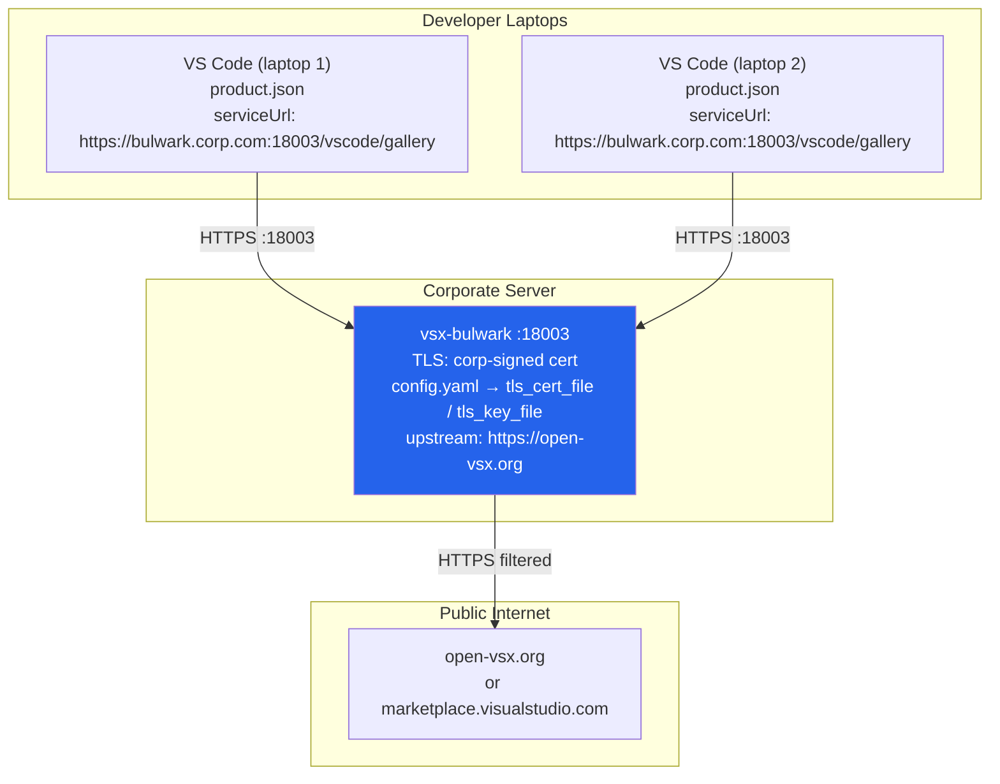

**Server setup:**
1. Set `tls_cert_file` and `tls_key_file` in `config.yaml` to a corp-CA-signed or Let's Encrypt certificate for the server hostname.
2. Run `vsx-bulwark -config config.yaml`.

**Laptop setup (each developer, run once):**
```bash
./vsx-bulwark -setup -server https://bulwark.corp.com:18003
```
This writes `product.json` to the detected VS Code-family user-data directories and records the configured targets in `~/.bulwark/vsx-bulwark/vsx-targets.json` so uninstall and Windows repair only touch the variants Bulwark actually configured. No binary is installed locally and no local proxy starts.

**Revert:**
```bash
./vsx-bulwark -uninstall
```

---

## 7. Request Filtering Pipeline — State Machine

Every proxy request follows the same decision pipeline. The diagram below shows the PyPI simple-index path as the canonical example.

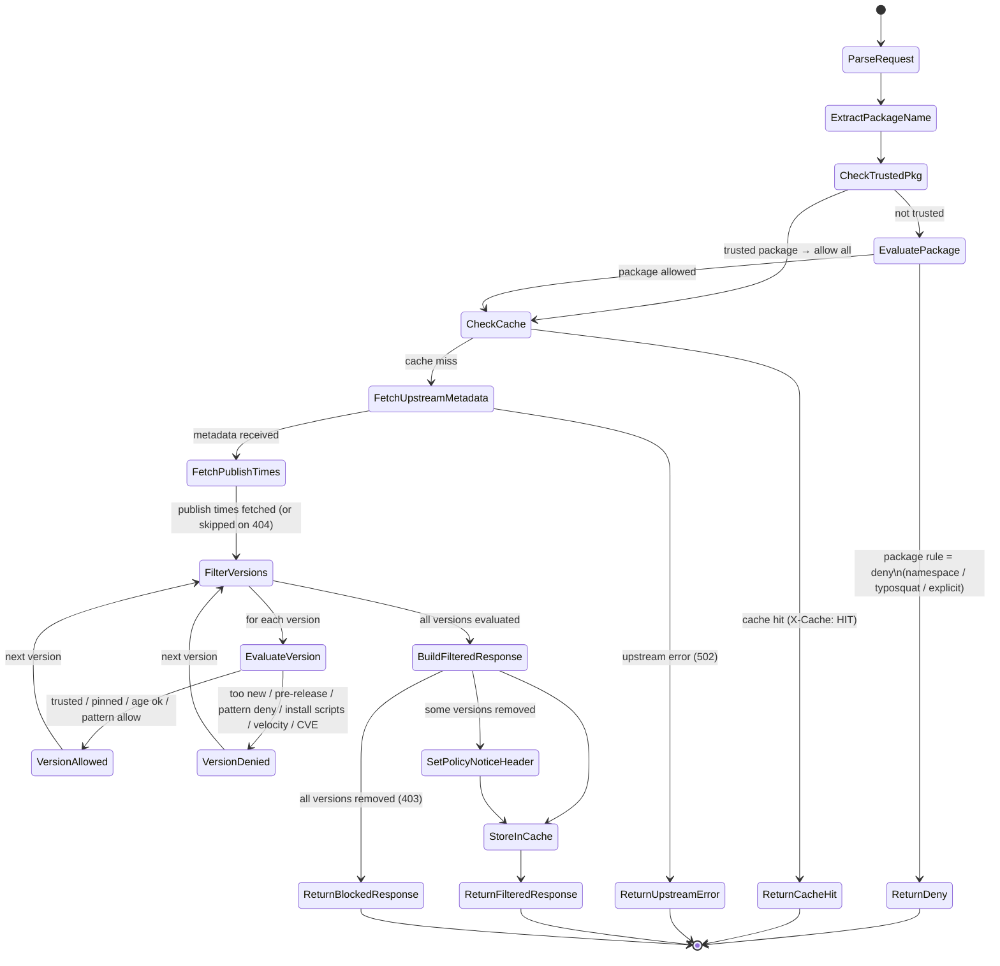

---

### Block Response Behaviour

When a package is entirely blocked — either by a package-level deny rule or because every individual version was removed by version-level rules — the proxy returns **HTTP 403 Forbidden** with a clear `[Bulwark]` policy reason in the response body instead of an empty version list.

**Package-level / all-versions-removed blocks (metadata endpoints):**

| Ecosystem | Response Format               | Example Body                                                            |
| --------- | ----------------------------- | ----------------------------------------------------------------------- |
| **npm**   | JSON `{"error":"..."}`        | `{"error":"[Bulwark] event-stream: package matches deny list"}`         |
| **PyPI**  | Plain text                    | `[Bulwark] requests: all available versions blocked by policy`          |
| **Maven** | Plain text (via `http.Error`) | `[Bulwark] com.example:mylib: all available versions blocked by policy` |
| **VSX**   | Plain text (via `http.Error`) | `[Bulwark] ns.ext: all available versions blocked by policy`            |

**Direct download blocks (tarball / artifact / external URL / VSIX):**

| Ecosystem | Endpoint                                 | Example Body                                                       |
| --------- | ---------------------------------------- | ------------------------------------------------------------------ |
| **npm**   | tarball `/<pkg>/-/<file>.tgz`            | `[Bulwark] lodash@5.0.0-beta.1: pre-release version blocked`       |
| **npm**   | tarball (package-level)                  | `[Bulwark] event-stream: package matches deny list`                |
| **PyPI**  | `/external?url=...`                      | `[Bulwark] name too similar to protected package 'requests'`       |
| **Maven** | artifact `/.../1.0-RC1/lib.jar`          | `[Bulwark] com/example:mylib@1.0-RC1: pre-release version blocked` |
| **Maven** | artifact (package-level)                 | `[Bulwark] com/example:mylib: package matches deny list`           |
| **VSX**   | VSIX `/api/{ns}/{ext}/{ver}/file/{file}` | `[Bulwark] ns.ext@1.0.0-rc.1: pre-release version blocked`         |
| **VSX**   | VSIX (package-level)                     | `[Bulwark] ns.ext: package matches deny list`                      |
| **VSX**   | gallery vspackage (package-level)        | `[Bulwark] ns.ext: package matches deny list`                      |

This ensures package managers display a meaningful error message (e.g., npm shows the `error` field) instead of confusing messages like `ENOVERSIONS` (npm) or "No matching distribution found" (pip).

When only _some_ versions are blocked, the proxy still returns a **200 OK** with the filtered response and an `X-Curation-Policy-Notice` header indicating how many versions were removed.

**Cached 403 responses** are stored in the in-memory cache with the same TTL as normal responses, so repeated requests for blocked packages are served from cache.

---

## 8. Sequence Diagram — PyPI Package Install (Topology A)

`pip install requests` with age filter of 7 days. Three versions exist: two old enough, one too new.

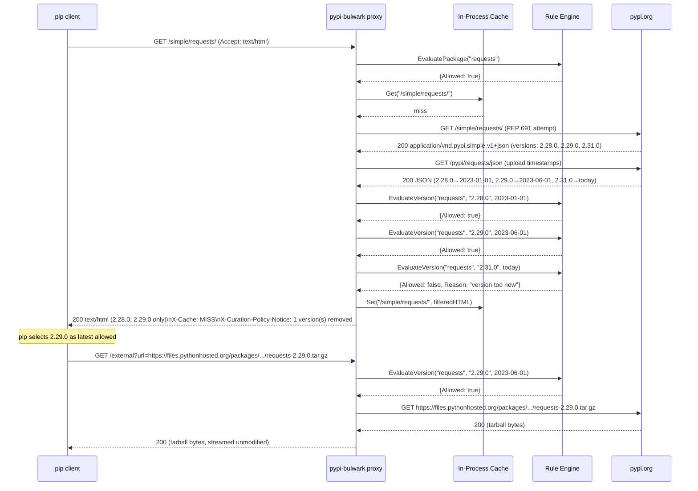

---

## 9. Sequence Diagram — PyPI Package Install (Topology B via Enterprise Registry)

Same `pip install requests` but the enterprise registry is in the middle.


---

## 10. Sequence Diagram — npm Package Install (Topology A)

`npm install lodash`. Age filter 30 days. One version too new.

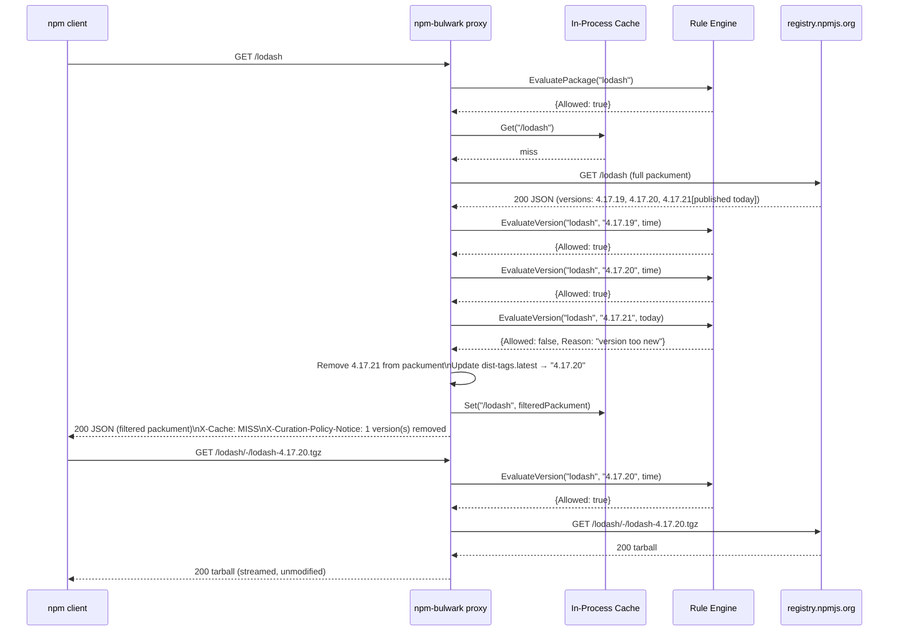

---

## 11. Sequence Diagram — Typosquatting Detection

An attacker publishes `reqvests` (edit distance 1 from `requests`). A developer mistypes the package name.

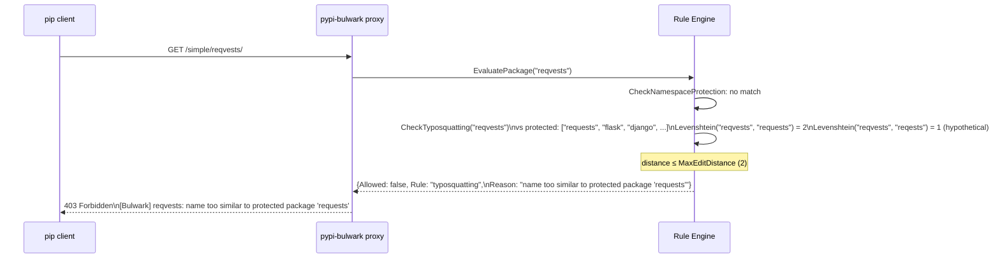

---

## 12. Sequence Diagram — Dynamic Log Level via Admin API

Operator changes the log level at runtime without restarting the proxy.

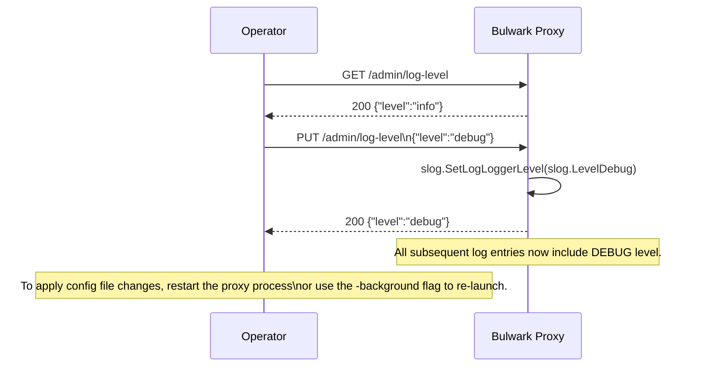

---

## 13. Sequence Diagram — Cache Behaviour (HIT path)

Second request for the same package within TTL.

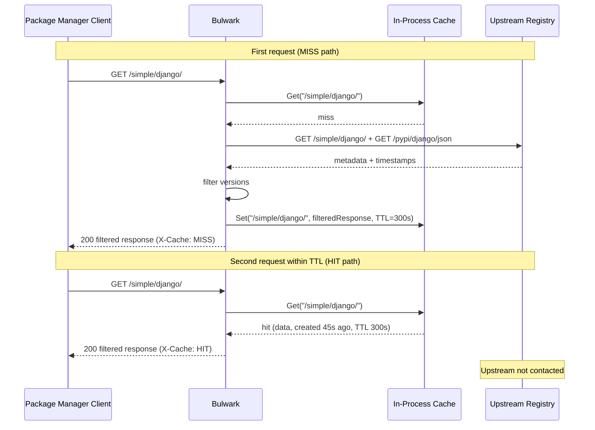

---

## 14. Sequence Diagram — Upstream Error Handling

The upstream registry returns a 503. The proxy fails gracefully.

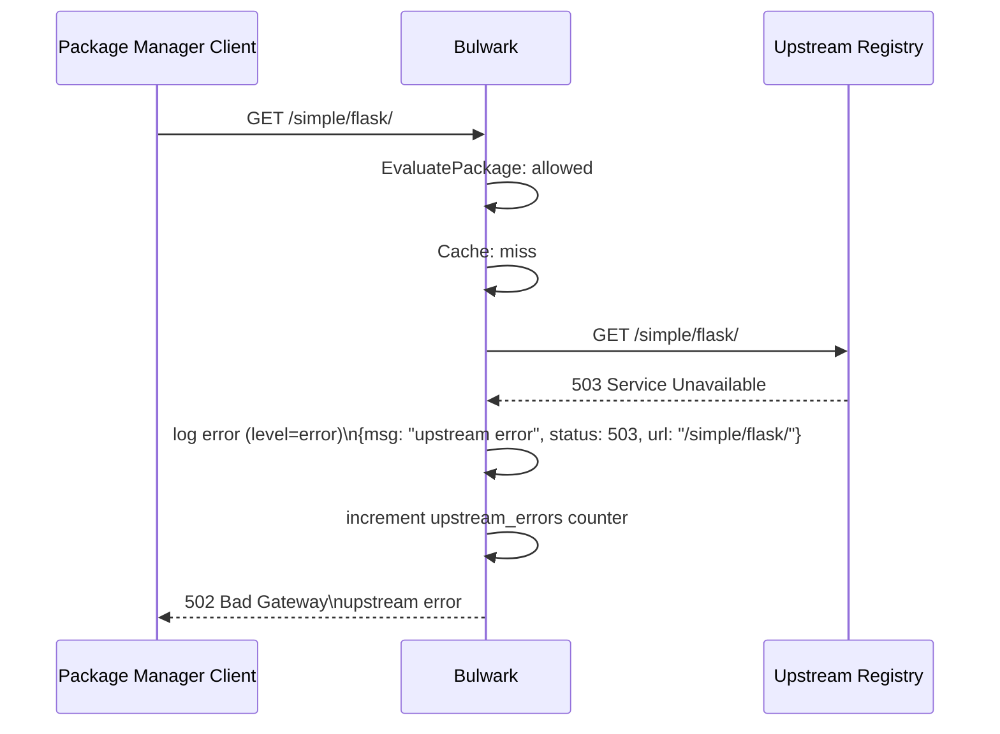

---

## 15. Sequence Diagram — VS Code Gallery Extension Search

`VS Code` searches for an extension. One result matches a deny rule and is removed from the response before the editor sees it.

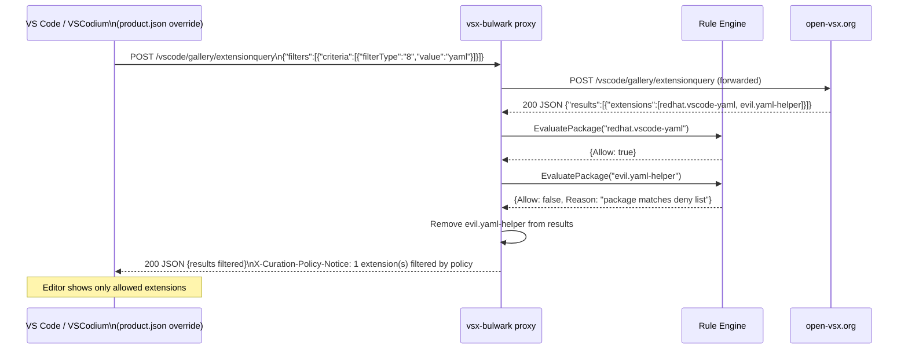

---

## 16. Deployment — Kubernetes (Single Ecosystem)

Standard Kubernetes deployment for `pypi-bulwark` in a dedicated namespace.

```mermaid
flowchart TB
    subgraph Kubernetes Cluster
        subgraph curation-ns — namespace
            direction TB
            SA["ServiceAccount\nbulwark-pypi-sa\n(no RBAC)"]
            CM["ConfigMap\nbulwark-pypi-config\nconfig.yaml data key"]
            SVC["Service\nClusterIP :18000\n→ pods :18000"]

            subgraph Deployment — 2 replicas
                POD1["Pod 1\npypi-bulwark container\nUID 1001 (non-root)\nresources: 100m/64Mi req\n500m/256Mi lim\nvolumeMount: /app/config.yaml"]
                POD2["Pod 2\n(same spec)"]
            end

            CM --> POD1
            CM --> POD2
            SA --> POD1
            SA --> POD2
        end

        subgraph dev-tools — namespace
            PIP["Developer Pod\n(pip, npm, cargo, etc.)"]
        end

        subgraph monitoring — namespace
            PROM["Prometheus\n(scrapes /metrics via json-exporter sidecar)"]
        end

        PIP -->|ClusterIP| SVC
        SVC --> POD1
        SVC --> POD2
        PROM -->|scrape :18000/metrics| SVC
    end

    subgraph External
        PYPI2["pypi.org"]
    end

    POD1 -->|HTTPS| PYPI2
    POD2 -->|HTTPS| PYPI2
```

---

## 17. Data Flow — Rule Evaluation Priority Order

The rule engine evaluates rules in strict priority order. The first matching rule wins.

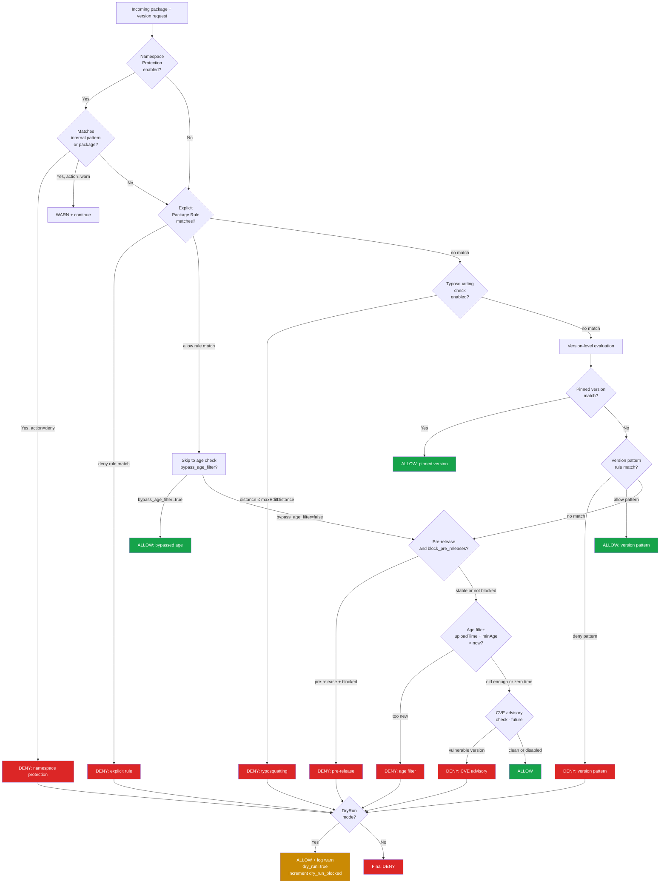

---

## 18. Component Interaction — Live E2E Test Stack (Topology A)

The E2E test suite compiles the proxy binaries, starts them as child processes, and sends real HTTP
requests to public package registries. **No mocks are used.** Tests are gated by `//go:build e2e`
and the `BULWARK_E2E_LIVE=true` environment variable.

Topology B compatibility cannot be tested in open-source CI. See
the Topology B section in `README.md` for integration guidance.

```mermaid
flowchart TB
    subgraph Live E2E Test Process
        TM["TestMain\ngo test -tags=e2e ./e2e/...\n\n1. go build each proxy binary\n2. start proxy processes\n3. wait for /healthz\n4. run test functions\n5. kill processes"]
    end

    subgraph Proxy Processes (test-managed child processes)
        PA["pypi-bulwark :18100\nupstream=https://pypi.org\nrules: allow all (age=0)"]
        NA["npm-bulwark :18101\nupstream=https://registry.npmjs.org\nrules: allow all (age=0)"]
        MA["maven-bulwark :18102\nupstream=https://repo1.maven.org/maven2\nrules: allow all (age=0)"]
        VA["vsx-bulwark :18103\nupstream=https://open-vsx.org\nrules: allow all (age=0)"]
    end

    subgraph Public Registries (real internet)
        PR["pypi.org\nPyPI Simple Index + Metadata API"]
        NR["registry.npmjs.org\nnpm packument API"]
        MR["repo1.maven.org/maven2\nMaven Central"]
        VR["open-vsx.org\nOpen VSX API"]
    end

    TM -->|HTTP :18100| PA
    TM -->|HTTP :18101| NA
    TM -->|HTTP :18102| MA
    TM -->|HTTP :18103| VA
    PA -->|HTTPS| PR
    NA -->|HTTPS| NR
    MA -->|HTTPS| MR
    VA -->|HTTPS| VR

    style TM fill:#2563eb,color:#fff
    style PA fill:#2563eb,color:#fff
    style NA fill:#2563eb,color:#fff
    style MA fill:#2563eb,color:#fff
    style VA fill:#2563eb,color:#fff
    style PR fill:#16a34a,color:#fff
    style NR fill:#16a34a,color:#fff
    style MR fill:#16a34a,color:#fff
    style VR fill:#16a34a,color:#fff
```

- Each test calls `t.Skip` if the upstream is unreachable (DNS failure, timeout) — never fails CI on transient outage.
- Stable, ancient packages are used (published ≥ 3 years ago) so age-filter and block rules can be exercised predictably.
- Tests do **not** assert on exact version lists (registries add versions over time); they assert on presence of specific known-old versions.

**Stable test packages:**

| Ecosystem | Package                 | Version     | Published  |
| --------- | ----------------------- | ----------- | ---------- |
| PyPI      | `pip`                   | `22.3.1`    | 2022-11-07 |
| PyPI      | `certifi`               | `2022.12.7` | 2022-12-07 |
| PyPI      | `urllib3`               | `1.26.14`   | 2023-01-11 |
| npm       | `lodash`                | `4.17.21`   | 2021-02-20 |
| npm       | `ms`                    | `2.1.3`     | 2020-03-17 |
| npm       | `is-odd`                | `3.0.1`     | 2018-10-15 |
| Maven     | `junit:junit`           | `4.13.2`    | 2021-02-13 |
| Maven     | `commons-io:commons-io` | `2.11.0`    | 2021-07-13 |
| Maven     | `org.slf4j:slf4j-api`   | `1.7.36`    | 2022-03-16 |

---

## 18.1 Docker-Based E2E Tests (Real Clients, Multi-Rule Configs)

In addition to the Go-based live E2E tests, the `e2e/docker/` directory contains Docker Compose-based integration tests that run real package manager clients through the curation proxies in containers. The test runner (`run.sh`) executes phases one at a time: each phase starts a single proxy container with a specific config, runs the corresponding test client container, then tears down before moving to the next phase.

Each ecosystem includes a **real-life** configuration where **all rules are active simultaneously**, simulating production enterprise policy:

- **npm** (`npm-real-life.yaml`): trusted scopes (`@types/*`, `@babel/*`), install scripts deny (esbuild exempted), 7-day age, pre-release block, explicit deny (event-stream), canary/nightly version patterns.
- **PyPI** (`pypi-real-life.yaml`): trusted packages (setuptools, pip, wheel), 7-day age, pre-release block, explicit deny (python3-dateutil), dev/alpha/beta version patterns.
- **Maven** (`maven-real-life.yaml`): trusted group (`org/apache/commons:*`, `commons-io:*`), 7-day age, pre-release block, SNAPSHOT block, explicit deny (junit:junit), milestone/RC version patterns.
- **VSX** (`vsx-real-life.yaml`): trusted publishers (`ms-python.*`, `ms-vscode.*`, `redhat.*`), 7-day age, pre-release block, explicit deny (malicious extensions), canary/insider version patterns.

**Total Docker E2E test count:** npm 33, PyPI 27, Maven 30, VSX 13 (103 tests across all phases).

See `e2e/docker/README.md` for the full test matrix.

---

## 19. Security Threat Model


---

## 20. Configuration Schema — Topology Selection

Both topologies are selected by changing a single configuration key. The same binary, same rule engine, same everything.

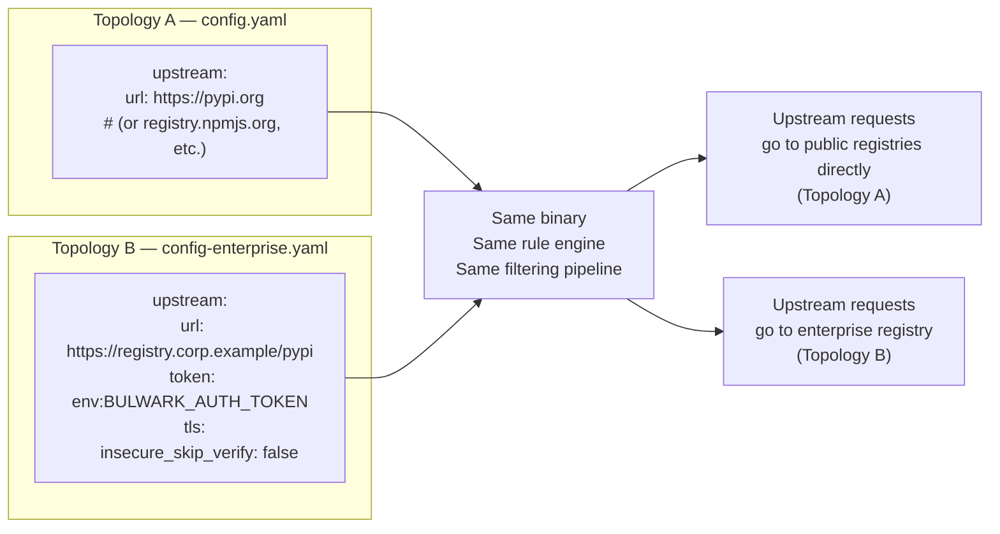

---

## 21. One-Click Installer Architecture

Each proxy binary embeds its `config-best-practices.yaml` via Go's `//go:embed` directive. The shared `common/installer` package provides platform-aware setup and uninstall logic.

### First-Run Auto-Setup

When a binary is launched without the `-config` flag and no existing config file is found, the proxy automatically performs a first-run setup before starting the server:

```mermaid
flowchart TD
    A["User launches binary\n(no flags)"] --> B{"resolveConfig()"}
    B -->|"-config explicitly set"| C["Use specified path"]
    B -->|"config.yaml in cwd"| D["Use local config"]
    B -->|"~/.bulwark/ config exists"| E["Use installed config"]
    B -->|"No config found"| F["First-Run Auto-Setup"]
    F --> G["installer.SetupFilesOnly()"]
    G --> H["Write best-practices\nconfig.yaml"]
    G --> I["Copy binary to\n~/.bulwark/bin/"]
    G --> J["Configure package manager"]
    G --> K["Create autostart entry"]
    H --> L["Start proxy server\nusing installed config"]
```

This means users can download a single binary, double-click it, and immediately have a fully configured proxy running with best-practices security rules.

### Explicit Setup / Uninstall

The `-setup` and `-uninstall` flags provide explicit control over the installation lifecycle:

```mermaid
flowchart TD
    A["User runs: binary -setup"] --> B["installer.Setup()"]
    B --> C["os.UserHomeDir()"]
    B --> D["os.Executable()"]
    C --> E["SetupFiles()"]
    D --> E
    E --> F["Create ~/.bulwark/<ecosystem>/"]
    E --> G["Write config.yaml\n(embedded best-practices)"]
    E --> H["Copy binary to\n~/.bulwark/bin/"]
    E --> I["writePkgMgrConfig()"]
    E --> J["writeAutostartFile()"]
    I --> K{"Ecosystem?"}
    K -->|npm| L["Deferred to ActivateServices"]
    K -->|pypi| M["Write pip.conf / pip.ini"]
    K -->|maven| N["Write settings.xml\n(backup existing)"]
    K -->|vsx| NA["Write product.json\nto user-data dirs\n(VSCodium, Code OSS)"]
    J --> O{"OS?"}
    O -->|macOS| P["Write LaunchAgent plist"]
    O -->|Linux| Q["Write systemd user service"]
    O -->|Windows| R["Write Startup .bat"]
    E --> S["ActivateServices()"]
    S --> T["npm config set registry\n(if npm ecosystem)"]
    S --> U{"OS?"}
    U -->|macOS| V["launchctl load"]
    U -->|Linux| W["systemctl --user enable"]
    U -->|Windows| X["Print manual start instructions"]
```

### Installed File Layout

```
~/.bulwark/
├── bin/
│   ├── npm-bulwark          # (or .exe on Windows)
│   ├── pypi-bulwark
│   ├── maven-bulwark
│   └── vsx-bulwark
├── npm-bulwark/
│   └── config.yaml           # Editable rules config
├── pypi-bulwark/
│   └── config.yaml
├── maven-bulwark/
│   └── config.yaml
└── vsx-bulwark/
    └── config.yaml
```

**VSX additionally writes `product.json` to editor user-data directories (and on Windows also to VS Code installation directories):**

| Editor           | Linux                        | macOS                                            | Windows (user-data)          | Windows (install dir, patched in-place)                               |
| ---------------- | ---------------------------- | ------------------------------------------------ | ---------------------------- | --------------------------------------------------------------------- |
| VS Code          | `~/.config/Code/`            | `~/Library/Application Support/Code/`            | `%APPDATA%\Code\`            | `%LOCALAPPDATA%\Programs\Microsoft VS Code\*\resources\app\` (glob)   |
| VS Code Insiders | `~/.config/Code - Insiders/` | `~/Library/Application Support/Code - Insiders/` | `%APPDATA%\Code - Insiders\` | `%LOCALAPPDATA%\Programs\Microsoft VS Code Insiders\*\resources\app\` |
| VSCodium         | `~/.config/VSCodium/`        | `~/Library/Application Support/VSCodium/`        | `%APPDATA%\VSCodium\`        | —                                                                     |
| Code - OSS       | `~/.config/Code - OSS/`      | `~/Library/Application Support/Code - OSS/`      | `%APPDATA%\Code - OSS\`      | —                                                                     |

The existing `product.json` (if any) is backed up as `product.json.bulwark-backup`. Uninstall restores from backup.

### Platform-Specific Autostart

| OS      | Mechanism            | File Location                                                               |
| ------- | -------------------- | --------------------------------------------------------------------------- |
| macOS   | LaunchAgent          | `~/Library/LaunchAgents/com.bulwark.<eco>.plist`                            |
| Linux   | systemd user service | `~/.config/systemd/user/bulwark-<eco>.service`                              |
| Windows | Startup batch file   | `%APPDATA%\Microsoft\Windows\Start Menu\Programs\Startup\bulwark-<eco>.bat` |

### Design Decisions

- **`//go:embed`** for config: the binary is self-contained; no need to download config separately.
- **First-run auto-setup**: `resolveConfig()` detects missing config and calls `installer.SetupFilesOnly()` (writes files but does not activate launchd/systemd, since the running process itself serves as the proxy).
- **`run()` function**: the proxy lifecycle (`handleInstallMode → resolveConfig → initServer → runServer`) is extracted from `main()` into a testable `run()` function that returns an error instead of calling `os.Exit`.
- **`-background` flag**: re-executes the binary as a detached child process (via `installer.Daemonize`). On Unix, uses `Setsid` to create a new session; on Windows, uses `CREATE_NEW_PROCESS_GROUP`. Output is logged to `~/.bulwark/<binary>/daemon.log`. Without this flag, the proxy runs in the foreground.
- **`goos` parameter** on all file-system functions: enables cross-platform unit testing without mocking `runtime.GOOS`.
- **Separation of `SetupFiles` vs `ActivateServices`**: file-only operations are fully unit-testable with `t.TempDir()`; external commands (`launchctl`, `systemctl`, `npm`) are isolated with documented coverage exemptions.
- **Maven backup/restore**: existing `settings.xml` is backed up to `settings.xml.bulwark-backup` on setup and restored on uninstall.
- **VSX product.json patching**: On Linux and macOS, a fresh overlay file is written to the editor user-data directory (`~/.config/Code/product.json` etc.) — these survive editor updates. On Windows, Microsoft VS Code reads `product.json` from its **installation directory** not the user-data folder, so `-setup` also merges the `extensionsGallery` key into `%LOCALAPPDATA%\Programs\Microsoft VS Code\*\resources\app\product.json` using `filepath.Glob` to handle Squirrel-versioned sub-directories. The in-place merge preserves all other product fields. Backups are written only on first setup; `-uninstall` restores from backup.
- **Auto-repair after VS Code updates (Windows)**: The Squirrel updater creates a new versioned sub-directory on each VS Code update, which replaces the previously patched `product.json` with a fresh one. `VsxRepairInstallDirs` is called at every proxy startup — it re-reads each candidate installation dir, compares the `extensionsGallery.serviceUrl`, and silently re-patches any file that no longer points at the proxy. This makes protection fully automatic: the proxy self-heals on the next OS login after a VS Code update without any user intervention. Existing backups are never overwritten, so `-uninstall` always restores to the state before Bulwark was first installed.
