# Architecture — PKGuard

This document provides the complete architectural reference for the PKGuard, including system context, component relationships, deployment topologies, and request-processing sequence diagrams. All diagrams use [Mermaid](https://mermaid.js.org) syntax.

---

## 1. System Context (C4 Level 1)

The PKGuard sits between developer tools and public package registries, acting as a policy enforcement gateway. It has no UI and no persistent database — all state is held in-process (config + cache).

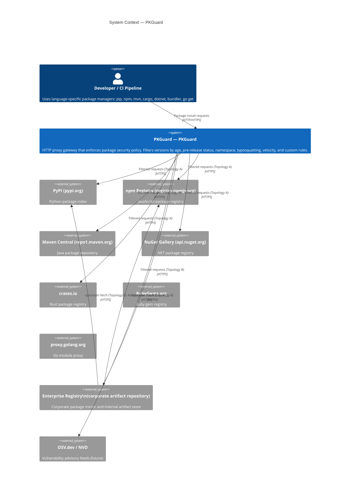

---

## 2. Container Diagram (C4 Level 2)

Each ecosystem is a self-contained Go binary. All binaries share the `common/` module for config types, rule engine, and cache.

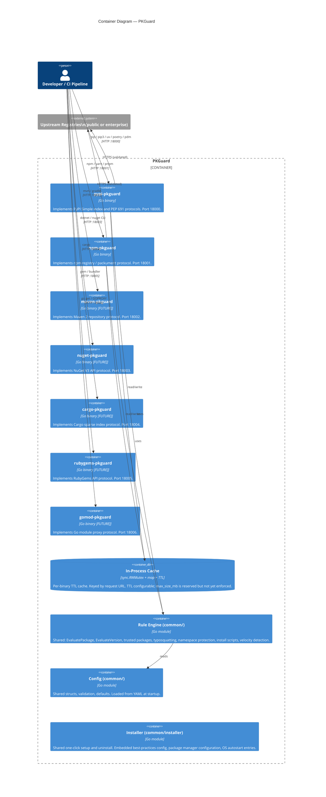

---

## 3. Component Diagram — Single Proxy Binary (C4 Level 3)

The internal structure of each proxy binary follows the same pattern. This diagram uses the PyPI proxy as the reference implementation.

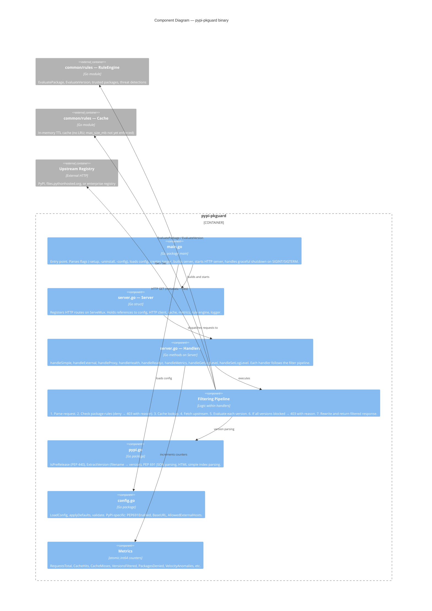

---

## 4. Deployment Topology A — Direct Proxy

Developer tools are pointed directly at the PKGuard. No enterprise registry is involved.

```mermaid
flowchart TD
    subgraph Developer Workstation / CI
        pip["pip / uv / poetry\n~/.pip/pip.conf\nindex-url = http://pkguard:18000/simple/"]
        npm_cli["npm / yarn / pnpm\n.npmrc\nregistry=http://pkguard:18001/"]
        mvn["mvn / gradle\nsettings.xml mirror\nurl: http://pkguard:18002/"]
        cargo_cli["cargo\n.cargo/config.toml\n[source.crates-io] replace-with = 'pkguard'\n[source.pkguard] registry = 'sparse+http://pkguard:18004/'"]
    end

    subgraph Kubernetes / Docker — PKGuard Proxy
        direction TB
        PyPI["pypi-pkguard :18000\nTopology A config\nupstream: https://pypi.org"]
        NPM["npm-pkguard :18001\nTopology A config\nupstream: https://registry.npmjs.org"]
        MVN["maven-pkguard :18002\nTopology A config\nupstream: https://repo1.maven.org"]
        CRG["cargo-pkguard :18004\nTopology A config\nupstream: https://sparse.crates.io"]
    end

    subgraph Public Internet
        PyPIReg["pypi.org\nfiles.pythonhosted.org"]
        NpmReg["registry.npmjs.org"]
        MavenCentral["repo1.maven.org"]
        CratesIO["crates.io / sparse.crates.io"]
    end

    pip -->|HTTP :18000| PyPI
    npm_cli -->|HTTP :18001| NPM
    mvn -->|HTTP :18002| MVN
    cargo_cli -->|HTTP :18004| CRG

    PyPI -->|HTTPS filtered| PyPIReg
    NPM -->|HTTPS filtered| NpmReg
    MVN -->|HTTPS filtered| MavenCentral
    CRG -->|HTTPS filtered| CratesIO

    style PyPI fill:#2563eb,color:#fff
    style NPM fill:#2563eb,color:#fff
    style MVN fill:#2563eb,color:#fff
    style CRG fill:#2563eb,color:#fff
```

---

## 5. Deployment Topology B — Enterprise Registry Middleware

Developer tools are pointed at the existing enterprise registry. The enterprise registry's remote/proxy repositories are reconfigured to fetch through the PKGuard. No developer client reconfiguration is needed.

```mermaid
flowchart TD
    subgraph Developer Workstation / CI
        pip2["pip / uv / poetry\nindex-url = https://registry.corp.example/pypi/simple/\n(unchanged from before)"]
        npm2["npm / yarn / pnpm\nregistry=https://registry.corp.example/npm/\n(unchanged)"]
    end

    subgraph Enterprise Registry — Corporate Artifact Repository
        direction TB
        ArtPyPI["PyPI Remote Repo\nRemote URL → http://pkguard:18000/simple/"]
        ArtNPM["npm Remote Repo\nRemote URL → http://pkguard:18001/"]
        ArtInternal["Internal / local repos\n(private packages — bypasses pkguard)"]
    end

    subgraph Kubernetes / Docker — PKGuard Proxy
        direction TB
        PyPIB["pypi-pkguard :18000\nTopology B config\nupstream: https://pypi.org\n(points at public — pkguard is the middle hop)"]
        NPMB["npm-pkguard :18001\nTopology B config\nupstream: https://registry.npmjs.org"]
    end

    subgraph Public Internet
        PyPIReg2["pypi.org"]
        NpmReg2["registry.npmjs.org"]
    end

    pip2 -->|HTTPS| ArtPyPI
    npm2 -->|HTTPS| ArtNPM

    ArtPyPI -->|HTTP (internal)| PyPIB
    ArtNPM -->|HTTP (internal)| NPMB

    PyPIB -->|HTTPS filtered| PyPIReg2
    NPMB -->|HTTPS filtered| NpmReg2

    style PyPIB fill:#2563eb,color:#fff
    style NPMB fill:#2563eb,color:#fff
    style ArtPyPI fill:#7c3aed,color:#fff
    style ArtNPM fill:#7c3aed,color:#fff
```

> **Note — Topology B variant:** Alternatively, the enterprise registry can be configured as the pkguard proxy's **upstream** (i.e. pkguard fetches from the enterprise registry, enterprise registry fetches from public). This variant is activated by setting `upstream.base_url` to the enterprise registry URL. In this case developers point at pkguard, and the enterprise registry sits **downstream** of public registries. Consult the `config-enterprise.yaml` files for both topologies.

---

## 6. Request Filtering Pipeline — State Machine

Every proxy request follows the same decision pipeline. The diagram below shows the PyPI simple-index path as the canonical example.

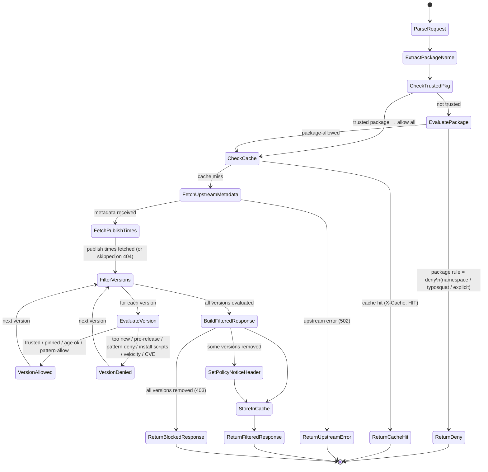

---

### Block Response Behaviour

When a package is entirely blocked — either by a package-level deny rule or because every individual version was removed by version-level rules — the proxy returns **HTTP 403 Forbidden** with a clear policy reason in the response body instead of an empty version list.

| Ecosystem | Response Format | Example Body |
|---|---|---|
| **npm** | JSON `{"error":"..."}` | `{"error":"[PKGuard] event-stream: package matches deny list"}` |
| **PyPI** | Plain text | `[PKGuard] requests: all available versions blocked by policy` |
| **Maven** | Plain text (via `http.Error`) | `[PKGuard] com.example:mylib: all available versions blocked by policy` |

This ensures package managers display a meaningful error message (e.g., npm shows the `error` field) instead of confusing messages like `ENOVERSIONS` (npm) or "No matching distribution found" (pip).

When only *some* versions are blocked, the proxy still returns a **200 OK** with the filtered response and an `X-Curation-Policy-Notice` header indicating how many versions were removed.

**Cached 403 responses** are stored in the in-memory cache with the same TTL as normal responses, so repeated requests for blocked packages are served from cache.

---

## 7. Sequence Diagram — PyPI Package Install (Topology A)

`pip install requests` with age filter of 7 days. Three versions exist: two old enough, one too new.


---

## 8. Sequence Diagram — PyPI Package Install (Topology B via Enterprise Registry)

Same `pip install requests` but the enterprise registry is in the middle.

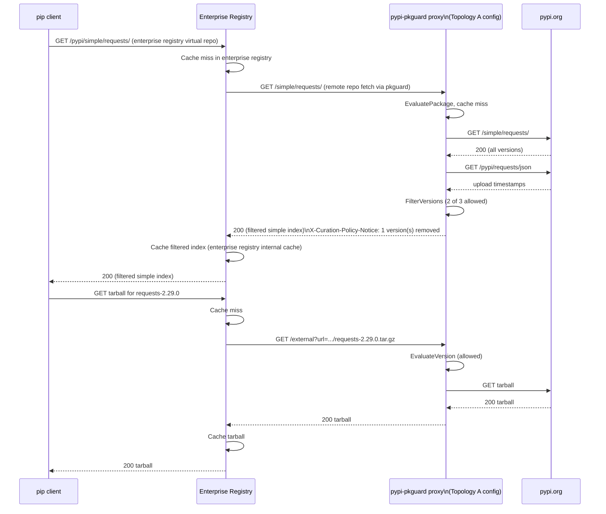

---

## 9. Sequence Diagram — npm Package Install (Topology A)

`npm install lodash`. Age filter 30 days. One version too new.


---

## 10. Sequence Diagram — Typosquatting Detection

An attacker publishes `reqvests` (edit distance 1 from `requests`). A developer mistypes the package name.

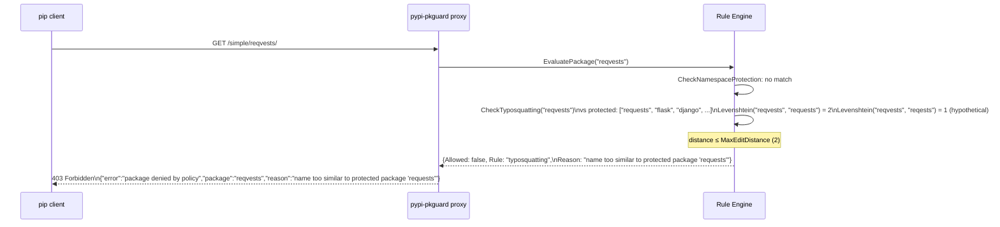

---

## 11. Sequence Diagram — Rule Reload via Admin API

Operator updates the rules YAML file on disk and triggers a live reload.

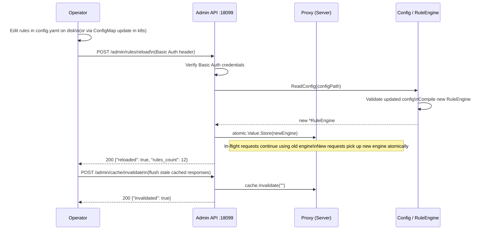

---

## 12. Sequence Diagram — Cache Behaviour (HIT path)

Second request for the same package within TTL.


---

## 13. Sequence Diagram — Upstream Error Handling

The upstream registry returns a 503. The proxy fails gracefully.

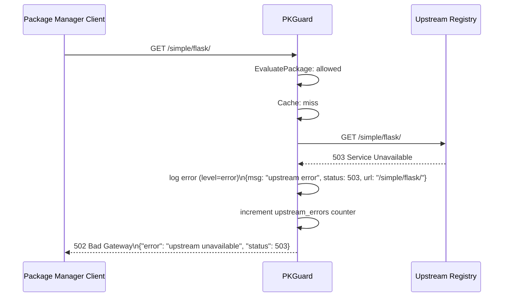

---

## 14. Deployment — Kubernetes (Single Ecosystem)

Standard Kubernetes deployment for `pypi-pkguard` in a dedicated namespace.

```mermaid
flowchart TB
    subgraph Kubernetes Cluster
        subgraph curation-ns — namespace
            direction TB
            SA["ServiceAccount\npkguard-pypi-sa\n(no RBAC)"]
            CM["ConfigMap\npkguard-pypi-config\nconfig.yaml data key"]
            SVC["Service\nClusterIP :18000\n→ pods :18000"]

            subgraph Deployment — 2 replicas
                POD1["Pod 1\npypi-pkguard container\nUID 1001 (non-root)\nresources: 100m/64Mi req\n500m/256Mi lim\nvolumeMount: /app/config.yaml"]
                POD2["Pod 2\n(same spec)"]
            end

            CM --> POD1
            CM --> POD2
            SA --> POD1
            SA --> POD2
        end

        subgraph dev-tools — namespace
            PIP["Developer Pod\n(pip, npm, cargo, etc.)"]
        end

        subgraph monitoring — namespace
            PROM["Prometheus\n(scrapes /metrics via json-exporter sidecar)"]
        end

        PIP -->|ClusterIP| SVC
        SVC --> POD1
        SVC --> POD2
        PROM -->|scrape :18000/metrics| SVC
    end

    subgraph External
        PYPI2["pypi.org"]
    end

    POD1 -->|HTTPS| PYPI2
    POD2 -->|HTTPS| PYPI2
```

---

## 15. Data Flow — Rule Evaluation Priority Order

The rule engine evaluates rules in strict priority order. The first matching rule wins.

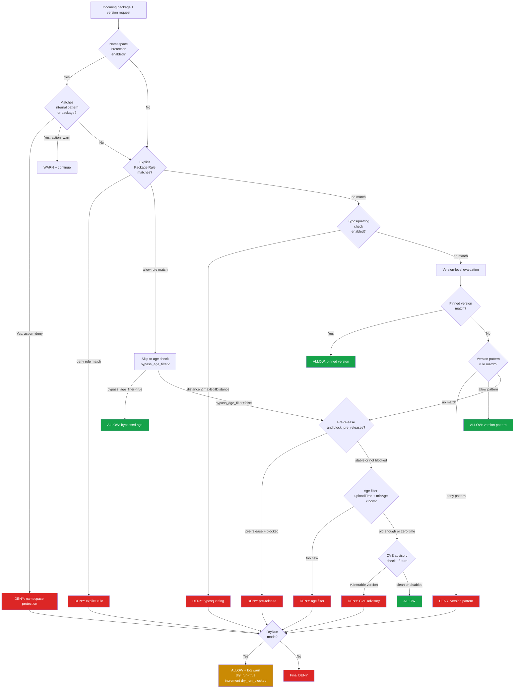

---

## 16. Component Interaction — Live E2E Test Stack (Topology A)

The E2E test suite compiles the proxy binaries, starts them as child processes, and sends real HTTP
requests to public package registries. **No mocks are used.** Tests are gated by `//go:build e2e`
and the `PKGUARD_E2E_LIVE=true` environment variable.

Topology B compatibility cannot be tested in open-source CI. See
the Topology B section in `README.md` for integration guidance.

```mermaid
flowchart TB
    subgraph Live E2E Test Process
        TM["TestMain\ngo test -tags=e2e ./e2e/...\n\n1. go build each proxy binary\n2. start proxy processes\n3. wait for /healthz\n4. run test functions\n5. kill processes"]
    end

    subgraph Proxy Processes (test-managed child processes)
        PA["pypi-pkguard :18100\nupstream=https://pypi.org\nrules: allow all (age=0)"]
        NA["npm-pkguard :18101\nupstream=https://registry.npmjs.org\nrules: allow all (age=0)"]
        MA["maven-pkguard :18102\nupstream=https://repo1.maven.org/maven2\nrules: allow all (age=0)"]
    end

    subgraph Public Registries (real internet)
        PR["pypi.org\nPyPI Simple Index + Metadata API"]
        NR["registry.npmjs.org\nnpm packument API"]
        MR["repo1.maven.org/maven2\nMaven Central"]
    end

    TM -->|HTTP :18100| PA
    TM -->|HTTP :18101| NA
    TM -->|HTTP :18102| MA
    PA -->|HTTPS| PR
    NA -->|HTTPS| NR
    MA -->|HTTPS| MR

    style TM fill:#2563eb,color:#fff
    style PA fill:#2563eb,color:#fff
    style NA fill:#2563eb,color:#fff
    style MA fill:#2563eb,color:#fff
    style PR fill:#16a34a,color:#fff
    style NR fill:#16a34a,color:#fff
    style MR fill:#16a34a,color:#fff
```

**Resilience rules:**

- Each test calls `t.Skip` if the upstream is unreachable (DNS failure, timeout) — never fails CI on transient outage.
- Stable, ancient packages are used (published ≥ 3 years ago) so age-filter and block rules can be exercised predictably.
- Tests do **not** assert on exact version lists (registries add versions over time); they assert on presence of specific known-old versions.

**Stable test packages:**

| Ecosystem | Package                 | Version     | Published  |
| --------- | ----------------------- | ----------- | ---------- |
| PyPI      | `pip`                   | `22.3.1`    | 2022-11-07 |
| PyPI      | `certifi`               | `2022.12.7` | 2022-12-07 |
| PyPI      | `urllib3`               | `1.26.14`   | 2023-01-11 |
| npm       | `lodash`                | `4.17.21`   | 2021-02-20 |
| npm       | `ms`                    | `2.1.3`     | 2020-03-17 |
| npm       | `is-odd`                | `3.0.1`     | 2018-10-15 |
| Maven     | `junit:junit`           | `4.13.2`    | 2021-02-13 |
| Maven     | `commons-io:commons-io` | `2.11.0`    | 2021-07-13 |
| Maven     | `org.slf4j:slf4j-api`   | `1.7.36`    | 2022-03-16 |

---

## 16.1 Docker-Based E2E Tests (Real Clients, Multi-Rule Configs)

In addition to the Go-based live E2E tests, the `e2e/docker/` directory contains Docker Compose-based integration tests that run real package manager clients through the curation proxies in containers. The test runner (`run.sh`) executes phases one at a time: each phase starts a single proxy container with a specific config, runs the corresponding test client container, then tears down before moving to the next phase.

Each ecosystem includes a **real-life** configuration where **all rules are active simultaneously**, simulating production enterprise policy:

- **npm** (`npm-real-life.yaml`): trusted scopes (`@types/*`, `@babel/*`), install scripts deny (esbuild exempted), 7-day age, pre-release block, explicit deny (event-stream), canary/nightly version patterns.
- **PyPI** (`pypi-real-life.yaml`): trusted packages (setuptools, pip, wheel), 7-day age, pre-release block, explicit deny (python3-dateutil), dev/alpha/beta version patterns.
- **Maven** (`maven-real-life.yaml`): trusted group (`org/apache/commons:*`, `commons-io:*`), 7-day age, pre-release block, SNAPSHOT block, explicit deny (junit:junit), milestone/RC version patterns.

**Total Docker E2E test count:** npm 33, PyPI 27, Maven 30 (90 tests across all phases).

See `e2e/docker/README.md` for the full test matrix.

---

## 17. Security Threat Model

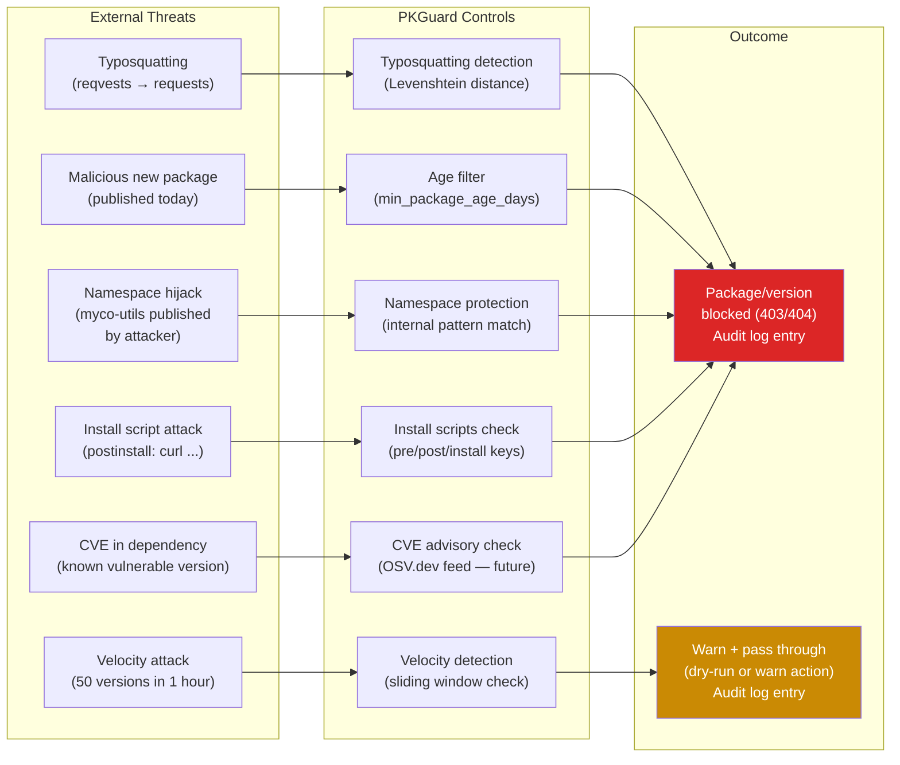

---

## 18. Configuration Schema — Topology Selection

Both topologies are selected by changing a single configuration key. The same binary, same rule engine, same everything.

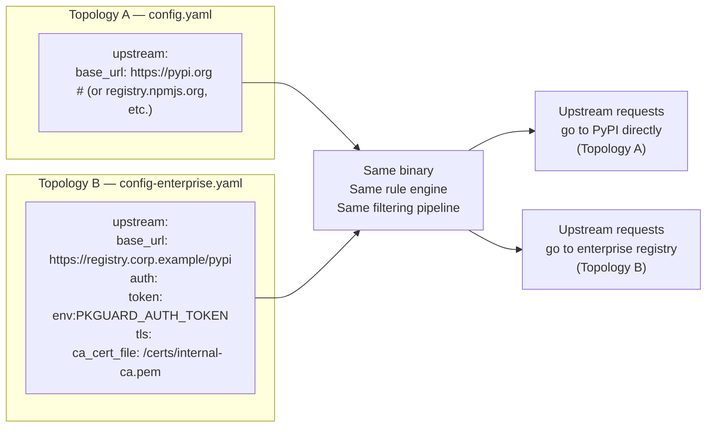

---

## 19. One-Click Installer Architecture

Each proxy binary embeds its `config-best-practices.yaml` via Go's `//go:embed` directive. The shared `common/installer` package provides platform-aware setup and uninstall logic.

### Installer Flow

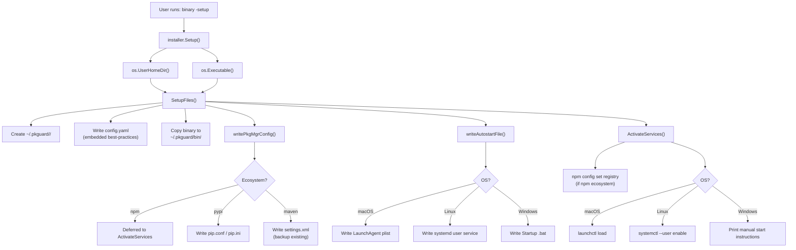

### Installed File Layout

```
~/.pkguard/
├── bin/
│   ├── npm-pkguard          # (or .exe on Windows)
│   ├── pypi-pkguard
│   └── maven-pkguard
├── npm-pkguard/
│   └── config.yaml           # Editable rules config
├── pypi-pkguard/
│   └── config.yaml
└── maven-pkguard/
    └── config.yaml
```

### Platform-Specific Autostart

| OS | Mechanism | File Location |
|----|-----------|---------------|
| macOS | LaunchAgent | `~/Library/LaunchAgents/com.pkguard.<eco>.plist` |
| Linux | systemd user service | `~/.config/systemd/user/pkguard-<eco>.service` |
| Windows | Startup batch file | `%APPDATA%\Microsoft\Windows\Start Menu\Programs\Startup\pkguard-<eco>.bat` |

### Design Decisions

- **`//go:embed`** for config: the binary is self-contained; no need to download config separately.
- **`goos` parameter** on all file-system functions: enables cross-platform unit testing without mocking `runtime.GOOS`.
- **Separation of `SetupFiles` vs `ActivateServices`**: file-only operations are fully unit-testable with `t.TempDir()`; external commands (`launchctl`, `systemctl`, `npm`) are isolated with documented coverage exemptions.
- **Maven backup/restore**: existing `settings.xml` is backed up to `settings.xml.pkguard-backup` on setup and restored on uninstall.
